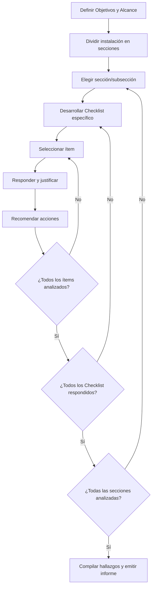

# Análisis Checklist en ERS: Metodología de Verificación Normativa

## Introducción

El **análisis mediante checklist** constituye el **Paso N° 2** en el desarrollo de un Estudio de Riesgos de Seguridad (ERS), denominado **"Verificar el Cumplimiento Normativo"**. Esta técnica es fundamental para detectar deficiencias que pueden convertirse en riesgos y asegurar que la instalación cumple con los requisitos legales y técnicos establecidos.

## ¿Qué son las Listas de Verificación?

Las listas de verificación son **herramientas estructuradas con ítems o preguntas predefinidas** utilizadas para:

- Verificar el estado técnico y documental de un sistema
- Confirmar el cumplimiento de normas, guías y buenas prácticas
- Identificar peligros por deficiencias de diseño o equipos obsoletos
- Detectar ausencia de procedimientos críticos

## Objetivo Principal del Checklist en ERS

**Apoyar la identificación de peligros** mediante la verificación de que el diseño, construcción y operación:

- Están alineados con normas técnicas vigentes
- Cumplen con distancias mínimas de separación
- Incluyen procedimientos obligatorios de seguridad
- No presentan fallas o vacíos normativos

## Elementos Clave que se Verifican

### 1. Estado de la Instalación Existente

- Desviaciones del diseño original
- Equipos sin certificación vigente
- Cumplimiento del layout con códigos actuales

### 2. Procedimientos Operativos

- Existencia de manuales aprobados
- Cumplimiento de programas de mantenimiento
- Aplicación de permisos de trabajo y control de cambios

### 3. Distancias de Separación

- Separaciones mínimas entre equipos según NFPA 30, API 2510
- Cumplimiento de normativas OSINERGMIN
- Distancias a zonas vulnerables (viviendas, oficinas)

### 4. Deficiencias de Diseño

- Ausencia de válvulas de alivio
- Sistemas contra incendios inadecuados
- Venteos insuficientes

## Ventajas de las Listas de Verificación

| Ventaja                               | Descripción                                |
| ------------------------------------- | ------------------------------------------ |
| **Económica y fácil de usar**         | No requiere software especializado         |
| **Aplicación individual**             | Aunque puede beneficiarse de talleres      |
| **Ideal para instalaciones estándar** | Tanques, estaciones, ductos                |
| **Fases tempranas de proyectos**      | Cuando no se dispone de todos los sistemas |

## Limitaciones y Desventajas

| Limitación                              | Impacto                                   |
| --------------------------------------- | ----------------------------------------- |
| **Omisión de riesgos no listados**      | Lo que no está en la lista se omite       |
| **Dependencia de la experiencia**       | Lista mal diseñada da falsa seguridad     |
| **No adecuada para procesos complejos** | Tecnologías innovadoras o nuevas          |
| **Requiere complemento**                | Debe combinarse con técnicas como What If |

## Conformación del Equipo de Trabajo

### Roles Mínimos Requeridos (3)

1. **Líder o Facilitador del Taller**

    - Dirige la sesión y aplica la metodología
    - Resuelve dudas técnicas
    - Guía al equipo multidisciplinario

2. **Escriba o Secretario**

    - Registra respuestas y observaciones
    - Documenta hallazgos durante la revisión
    - Mantiene trazabilidad del proceso

3. **Expertos Técnicos**
    - Evalúan cada ítem según experiencia
    - Detectan fallas y proponen medidas
    - Representan diferentes disciplinas

### Perfil de Expertos (Mínimo 3 Áreas)

Según el **Apéndice B de la R.D. N° 129-2021-MINEM/DGH**:

#### Obligatorios:

- **Ingeniería de Procesos**: Diseño y condiciones de operación
- **Operaciones**: Experiencia práctica diaria
- **Seguridad de Procesos**: Sistemas instrumentados y mitigaciones

#### Complementarios (Recomendables):

- **Ingeniería de Proyectos**: Para instalaciones nuevas
- **Instrumentación y Control**: Alarmas y válvulas automáticas
- **Mantenimiento**: Fallas recurrentes y obsolescencia
- **HSE**: Condiciones de trabajo seguro
- **Confiabilidad**: Historial de fallas y redundancias

## Consideraciones Metodológicas

### 1. División del Proceso en Secciones

El proceso se divide en partes manejables:

- Almacenamiento
- Despacho
- Control
- Servicios auxiliares

### 2. Elaboración del Checklist

El facilitador genera la lista basándose en:

- Normas técnicas (NFPA, API, D.S. 043-2007-EM)
- Requisitos operativos específicos
- Buenas prácticas internacionales

### 3. Enfoque Técnico y Normativo

Orientación al cumplimiento de:

- Distancias de separación
- Instrumentación de seguridad
- Procedimientos y medidas de control

### 4. Visitas de Campo

Inspecciones visuales para confirmar:

- Estado físico de equipos
- Señalización y alarmas
- Rutas de evacuación
- Cumplimiento real vs. documentado

## Proceso Metodológico Paso a Paso

## Ejemplo Práctico: Terminal de Combustibles

### Estructura de Secciones

| ID   | Sección                    | Subsección  |
| ---- | -------------------------- | ----------- |
| S1.1 | Zona de almacenamiento     | Cubeto N° 1 |
| S1.2 | Zona de almacenamiento     | Cubeto N° 2 |
| S1.3 | Zona de almacenamiento     | Cubeto N° 3 |
| S2   | Zona de bombas de despacho | ---         |
| S3   | Zona de islas de despacho  | ---         |
| S4   | Zona de ACI (Aditivos)     | ---         |
| S5   | Sala de control            | ---         |
| S6   | Zona administrativa        | ---         |
| S7   | Servicios auxiliares       | ---         |
| S8   | Tratamiento de aguas       | ---         |

### Formato de Hoja de Verificación

**Ejemplo: Sistema Contra Incendios - Red de Hidrantes**

| Ítem | Tópico                     | Norma               | ¿Cumple con...?                        | Resp.   | Comentario                          | Recomendación                      |
| ---- | -------------------------- | ------------------- | -------------------------------------- | ------- | ----------------------------------- | ---------------------------------- |
| 1    | Distancias entre hidrantes | NFPA 24, Sec. 7.2.1 | Hidrantes a ≤ 100m uno del otro        | Sí      | Distancia máxima: 87m entre H2 y H3 | ---                                |
| 2    | Mantenimiento preventivo   | NFPA 25, Sec. 6.3.1 | Inspección anual documentada           | No      | Último reporte del 2022             | Programar prueba hidráulica        |
| 3    | Señalización               | D.S. 043-2007-EM    | Señalización visible sin obstrucciones | Parcial | H3 cubierto por vegetación          | Retirar vegetación, instalar señal |

## Marco Normativo de Referencia

### Normativa Nacional

- **D.S. N° 043-2007-EM**: Reglamento de Seguridad para Hidrocarburos
- **D.S. N° 052-93-EM**: Almacenamiento de Hidrocarburos
- **R.C.D. N° 088-2022-OS/CD**: Contenido mínimo del ERS
- Normas OSINERGMIN vigentes

### Normas Internacionales

- **NFPA 30**: Almacenamiento de líquidos inflamables
- **NFPA 24**: Sistemas privados contra incendios
- **NFPA 25**: Inspección y mantenimiento de sistemas
- **API 650/653**: Tanques de almacenamiento
- **API 2510**: Tanques de GLP
- **IEC 31010**: Técnicas de evaluación de riesgos
- **CCPS (AIChE)**: Guidelines for Hazard Evaluation Procedures

## Medidas Alternativas o Compensatorias

Cuando no se puede cumplir estrictamente con un artículo normativo, el **D.S. N° 036-2020-EM** permite:

### Requisitos para Medidas Compensatorias

- Estar respaldadas en **prácticas internacionales de ingeniería**
- Garantizar **nivel de seguridad igual o superior**
- Incluir **justificación técnica detallada**
- Contar con **evaluación de efectividad**

### Proceso de Aprobación

1. Presentación ante OSINERGMIN dentro del ERS
2. Evaluación en plazo de **30 días hábiles**
3. Aprobación si cumple criterios de seguridad
4. Fiscalización posterior del cumplimiento

### Ejemplo Práctico

**Situación**: Válvulas de activación de espuma expuestas sin protección

**Medida Compensatoria**: Construcción de muro cortafuego según:

- NFPA 11, Sección 10.5.1.3
- NFPA 15, Sección 5.7.2.3

## Contenido del Informe Checklist

El informe debe incluir:

### Secciones Obligatorias

1. **Introducción**: Objetivo y aplicación del checklist
2. **Definiciones y abreviaturas**: Términos técnicos empleados
3. **Objetivos y alcance**: Qué se revisó y con qué propósito
4. **Descripción del proceso**: Sistema/área evaluada
5. **Documentos de referencia**: Normas utilizadas
6. **Descripción metodológica**: Cómo se aplicó
7. **Lista de participantes**: Equipo técnico
8. **Recomendaciones**: Observaciones y acciones sugeridas
9. **Planillas checklist**: Registro de ítems analizados
10. **Anexos**: Planos, fotos, documentos de evidencia

## Mejores Prácticas

### Durante la Aplicación

- Dividir la instalación sistemáticamente
- Documentar todas las respuestas con evidencia
- Realizar inspecciones visuales complementarias
- Mantener enfoque técnico y objetivo

### En la Documentación

- Usar codificación clara (colores: verde/cumple, rojo/no cumple, amarillo/parcial)
- Incluir referencias normativas específicas
- Anexar evidencia fotográfica
- Registrar fechas y responsables de verificación

### Para el Seguimiento

- Establecer cronograma de implementación de medidas
- Asignar responsables específicos
- Definir indicadores de cumplimiento
- Programar verificaciones posteriores

## Limitaciones y Complementos

### Limitaciones del Checklist

- No identifica riesgos no previstos en la lista
- Dependiente de la experiencia del elaborador
- No adecuado para procesos innovadores
- Puede generar falsa sensación de seguridad

### Técnicas Complementarias Recomendadas

- **What If**: Para pensar fuera de lo estructurado
- **HAZOP**: Para desviaciones operativas específicas
- **HAZID**: Para identificación general de peligros
- **Inspecciones de campo**: Para validar información documental

## Conclusiones

La técnica de checklist es fundamental en el **Paso N° 2** del ERS, proporcionando una base sólida para:

- **Detectar deficiencias normativas** que aumentan el riesgo
- **Identificar escenarios accidentales** potenciales desde el diseño
- **Priorizar acciones correctivas** antes de la cuantificación del riesgo
- **Cumplir requisitos regulatorios** del ERS como instrumento de gestión

Su correcta aplicación, complementada con otras técnicas de análisis, asegura una evaluación integral del cumplimiento normativo y sienta las bases para un análisis de riesgos robusto y confiable.

La integración de equipos multidisciplinarios y el uso de normativas reconocidas internacionalmente garantizan que los checklist sean herramientas efectivas para la gestión de la seguridad en instalaciones de hidrocarburos.

---

_La implementación exitosa de checklist requiere experiencia técnica, conocimiento normativo actualizado y enfoque sistemático. Se recomienda la participación de especialistas certificados y la revisión periódica de las listas conforme evoluciona la normativa y tecnología._
